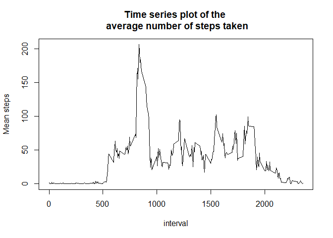
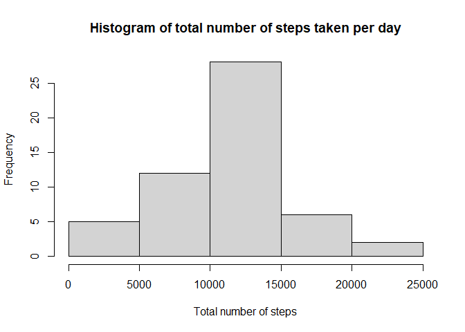
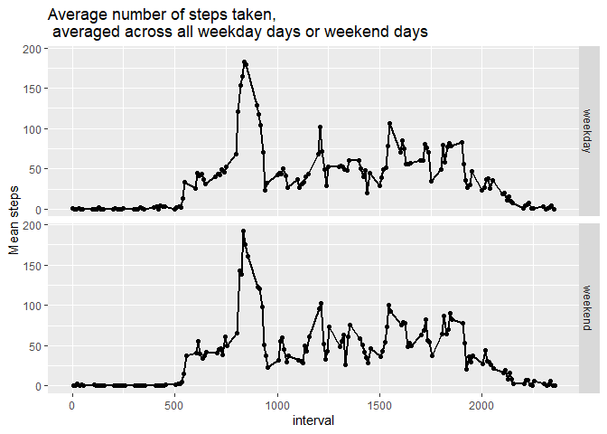

## Loading and preprocessing the data

```r
library(ggplot2)
```

```
## Warning: package 'ggplot2' was built under R version 4.0.3
```

```r
library(dplyr)
```

```
## Warning: package 'dplyr' was built under R version 4.0.3
```

```
## 
## Attaching package: 'dplyr'
```

```
## The following objects are masked from 'package:stats':
## 
##     filter, lag
```

```
## The following objects are masked from 'package:base':
## 
##     intersect, setdiff, setequal, union
```

```r
amd <- read.csv("activity.csv") ##Activity Monitoring Data(amd)
## Checking the data
dim(amd)
```

```
## [1] 17568     3
```

```r
str(amd)
```

```
## 'data.frame':	17568 obs. of  3 variables:
##  $ steps   : int  NA NA NA NA NA NA NA NA NA NA ...
##  $ date    : chr  "2012-10-01" "2012-10-01" "2012-10-01" "2012-10-01" ...
##  $ interval: int  0 5 10 15 20 25 30 35 40 45 ...
```

```r
head(amd)
```

```
##   steps       date interval
## 1    NA 2012-10-01        0
## 2    NA 2012-10-01        5
## 3    NA 2012-10-01       10
## 4    NA 2012-10-01       15
## 5    NA 2012-10-01       20
## 6    NA 2012-10-01       25
```

```r
tail(amd)
```

```
##       steps       date interval
## 17563    NA 2012-11-30     2330
## 17564    NA 2012-11-30     2335
## 17565    NA 2012-11-30     2340
## 17566    NA 2012-11-30     2345
## 17567    NA 2012-11-30     2350
## 17568    NA 2012-11-30     2355
```

```r
## checking the missing values
missing_amd <- amd[is.na(amd$steps),]
dim(missing_amd)
```

```
## [1] 2304    3
```

## What is mean total number of steps taken per day?

```r
##Total number of steps(tns)
##Calculate the total number of steps taken per day
tns <- with(amd, tapply(amd$steps, as.factor(amd$date), sum, na.rm = TRUE))

##Make a histogram of the total number of steps taken each day
hist(tns, main = "Histogram of total number of steps taken per day", xlab = "Total number of steps")
```

<!-- -->

```r
##Calculate and report the mean and median of the total number of steps taken per day
summary(tns)
```

```
##    Min. 1st Qu.  Median    Mean 3rd Qu.    Max. 
##       0    6778   10395    9354   12811   21194
```

## What is the average daily activity pattern?

```r
##Make a time series plot (i.e. type = “l”) of the 5-minute interval (x-axis) and the average number of steps taken, averaged across all days (y-axis)

mean_steps <- with(amd, tapply(amd$steps, amd$interval, mean,na.rm = TRUE))
interval <- levels(as.factor(amd$interval))
plot(interval, mean_steps, type = "l", main = "Time series plot of the \n average number of steps taken", xlab = "interval", ylab = "Mean steps")
```

<!-- -->

```r
##Which 5-minute interval, on average across all the days in the dataset, contains the maximum number of steps?

table <- data.frame(mean_steps, interval)
table[table$mean_steps==max(table$mean_steps),][2]
```

```
##     interval
## 835      835
```

## Imputing missing values

```r
##Calculate and report the total number of missing values in the dataset (i.e. the total number of rows with NAs)

length(missing_amd$steps)
```

```
## [1] 2304
```

```r
##Devise a strategy for filling in all of the missing values in the dataset. The strategy does not need to be sophisticated. For example, you could use the mean/median for that day, or the mean for that 5-minute interval, etc.

mean_steps <- with(amd, tapply(amd$steps, amd$interval, mean,na.rm = TRUE))
missing_amd$steps <- mean_steps

#Create a new dataset that is equal to the original dataset but with the missing data filled in.
new_dt <- rbind(amd, missing_amd)
new_dt <- new_dt[order(new_dt$date), ]

##Total number of steps with replaced missing values(tns2)
tns2 <- with(new_dt, tapply(steps, as.factor(new_dt$date), sum))
#Make a histogram of the total number of steps taken each day
hist(tns2, main = "Histogram of total number of steps taken per day", xlab = "Total number of steps")
```

<!-- -->

```r
##Mean and median total number of steps taken per day WITHOUT filling in the missing values
summary(tns)
```

```
##    Min. 1st Qu.  Median    Mean 3rd Qu.    Max. 
##       0    6778   10395    9354   12811   21194
```

```r
##Mean and median total number of steps taken per day WITH filling in the missing values
summary(tns2)
```

```
##    Min. 1st Qu.  Median    Mean 3rd Qu.    Max.    NA's 
##      41    8841   10765   10766   13294   21194       8
```

## Are there differences in activity patterns between weekdays and weekends?

```r
new_dt <- mutate(new_dt, days = weekdays(as.Date(new_dt$date)))
### find weekend features in the dataset
weekend_feature <- grep("Saturday|Sunday", new_dt$days, ignore.case = TRUE)
### subset data of the weekend
weekend_dt <- new_dt[weekend_feature, ]
weekend_dt$weekday <- "weekend"

### subset data of the weekday
weekday_dt <- subset(new_dt,new_dt$days!=weekend_feature)
```

```
## Warning in new_dt$days != weekend_feature: longer object length is not a
## multiple of shorter object length
```

```r
weekday_dt$weekday <- "weekday"

## create a new dataset containing 2 new variable "days" and weekday" 
## - days: indicates the days in the week
## - weekday: indicate the days are at the "weekend" or "weekday"
new_dt2 <- rbind(weekday_dt, weekend_dt)

##Panel plot showing the comparative variation of mean steps during weekdays and weekends
new_dt2$fact <- levels(as.factor(new_dt2$weekday))
mean_number_steps <- aggregate(steps~ interval+fact, new_dt2, mean)
g <- qplot(interval, steps, data = mean_number_steps, facets = fact~.)
g + geom_line(size = 1) + ylab("Mean steps") + ggtitle("Average number of steps taken, \n averaged across all weekday days or weekend days ")
```

<!-- -->
